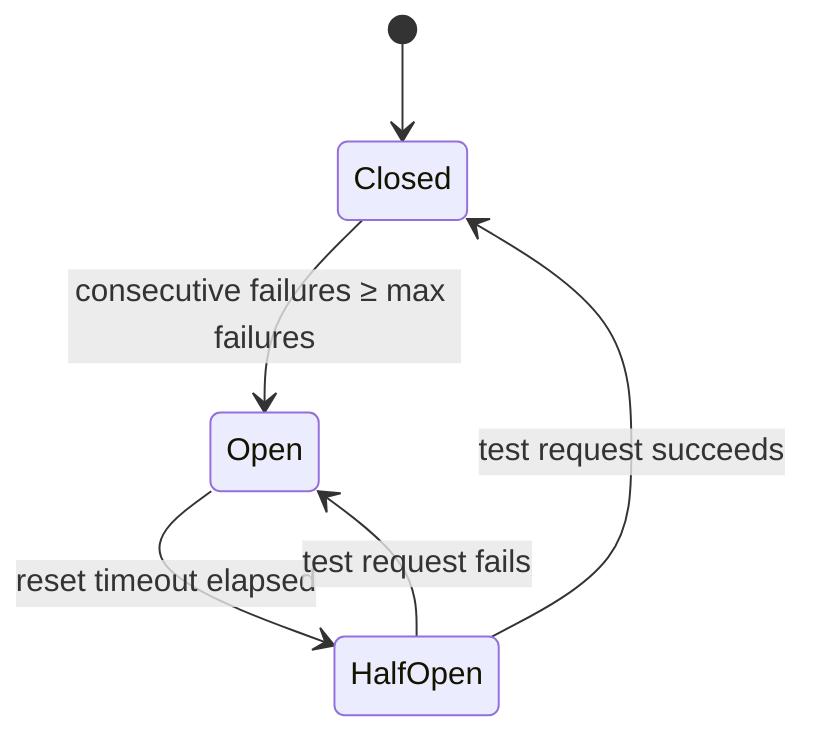

## HMAC Request Signing

Every callback we send to your endpoint is signed using **HMAC-SHA256**. This lets you verify that the request genuinely came from us and has not been tampered with.

### Signature Headers

Each signed callback includes two additional HTTP headers:

| Header        | Description                                                         |
| ------------- | ------------------------------------------------------------------- |
| `X-Timestamp` | Unix epoch seconds at the time the request was sent                 |
| `X-Signature` | HMAC-SHA256 signature in the format `sha256=<base64-encoded-value>` |

### How the Signature Is Computed

The signature is computed over the timestamp and the raw request body:

$$
\text{HMAC-SHA256}(\text{api\_client\_secret},\ \texttt{"\{X\text{-}Timestamp\}.\{body\}"})
$$

where `body` is the **exact JSON string** of the request body (no reformatting or whitespace changes).

### Verifying the Signature

Follow these steps in your callback handler to authenticate each inbound request:

<Steps>
  <Step title="Read the headers">
    Extract the `X-Timestamp` and `X-Signature` headers from the incoming request.
  </Step>
  <Step title="Check the timestamp">
    Reject the request if `X-Timestamp` is too old or too far in the future (we recommend a 5-minute tolerance window). This protects against replay attacks where an attacker resends a previously captured request.
  </Step>
  <Step title="Recompute the signature">
    Using your API client secret (UTF-8 encoded), compute:

    ```
    HMAC-SHA256("{X-Timestamp}.{raw request body}")
    ```

    Make sure you use the **raw, unmodified** request body bytes — do not parse and re-serialize the JSON.

  </Step>
  <Step title="Compare the signatures">
    Base64-encode your computed HMAC, then compare it against the value in `X-Signature` (strip the `sha256=` prefix first). If they match, the request is authentic. If they don't match, reject it with `401 Unauthorized`.
  </Step>
</Steps>

<Note>
  When you regenerate your API client secret, signed callbacks may continue to
  be generated with your previous secret for up to **5 minutes**. During this
  propagation window, verify signatures against both the old and new secrets.
</Note>

### Code Examples

<CodeGroup>

```scala Scala
import javax.crypto.Mac
import javax.crypto.spec.SecretKeySpec
import java.util.Base64
import scala.util.Try

def verifyCallback(
    apiClientSecret: String,
    timestampHeader: String,
    signatureHeader: String,
    rawBody: String
): Boolean = {

  // Compute HMAC-SHA256 over an arbitrary payload
  def hmac(payload: String): String = {
    val mac = Mac.getInstance("HmacSHA256")
    mac.init(new SecretKeySpec(apiClientSecret.getBytes("UTF-8"), "HmacSHA256"))
    Base64.getEncoder.encodeToString(
      mac.doFinal(payload.getBytes("UTF-8"))
    )
  }

  Try {
    val timestamp = timestampHeader.toLong
    val now       = System.currentTimeMillis() / 1000L
    val isFresh   = math.abs(now - timestamp) <= 300  // reject requests older / newer than 5 min
    val expected  = hmac(s"$timestampHeader.$rawBody") // sign "{timestamp}.{body}"
    val received  = signatureHeader.stripPrefix("sha256=")
    isFresh && expected == received
  }.getOrElse(false)
}
```

```typescript Node.js
import * as crypto from "crypto";

const verifyCallback = (
  apiClientSecret: string,
  timestampHeader: string,
  signatureHeader: string,
  rawBody: string,
): boolean => {
  // Reject requests whose timestamp is more than 5 minutes old or in the future
  const isFresh = (ts: string): boolean => {
    const t = parseInt(ts, 10);
    return !isNaN(t) && Math.abs(Math.floor(Date.now() / 1000) - t) <= 300;
  };

  // Sign an arbitrary payload string with the API client secret
  const computeHmac = (payload: string): string =>
    crypto
      .createHmac("sha256", apiClientSecret)
      .update(payload, "utf8")
      .digest("base64");

  // Use a constant-time comparison to prevent timing attacks
  const timingSafeEqual = (a: string, b: string): boolean =>
    a.length === b.length &&
    crypto.timingSafeEqual(Buffer.from(a), Buffer.from(b));

  return (
    isFresh(timestampHeader) &&
    timingSafeEqual(
      computeHmac(`${timestampHeader}.${rawBody}`), // sign "{timestamp}.{body}"
      signatureHeader.replace(/^sha256=/, ""), // strip the "sha256=" prefix
    )
  );
};
```

```python Python
import hmac
import hashlib
import base64
import time

def verify_callback(
    api_client_secret: str,
    timestamp_header: str,
    signature_header: str,
    raw_body: str,
) -> bool:
    # Reject requests whose timestamp is more than 5 minutes old or in the future
    def is_fresh(ts: str) -> bool:
        try:
            return abs(time.time() - int(ts)) <= 300
        except ValueError:
            return False

    # Sign an arbitrary payload string with the API client secret
    def compute_hmac(payload: str) -> str:
        return base64.b64encode(
            hmac.new(
                api_client_secret.encode("utf-8"),
                payload.encode("utf-8"),
                hashlib.sha256,
            ).digest()
        ).decode()

    # compare_digest provides a constant-time comparison to prevent timing attacks
    return is_fresh(timestamp_header) and hmac.compare_digest(
        compute_hmac(f"{timestamp_header}.{raw_body}"),  # sign "{timestamp}.{body}"
        signature_header.removeprefix("sha256="),         # strip the "sha256=" prefix
    )
```

```php PHP
function verifyCallback(
    string $apiClientSecret,
    string $timestampHeader,
    string $signatureHeader,
    string $rawBody
): bool {
    // Reject requests whose timestamp is more than 5 minutes old or in the future
    $isFresh = static fn(string $ts): bool =>
        abs(time() - (int) $ts) <= 300;

    // Sign an arbitrary payload string with the API client secret
    $computeHmac = static fn(string $payload): string =>
        base64_encode(hash_hmac('sha256', $payload, $apiClientSecret, true));

    // hash_equals provides a constant-time comparison to prevent timing attacks
    return $isFresh($timestampHeader) && hash_equals(
        $computeHmac("{$timestampHeader}.{$rawBody}"),  // sign "{timestamp}.{body}"
        preg_replace('/^sha256=/', '', $signatureHeader) // strip the "sha256=" prefix
    );
}
```

```java Java
import javax.crypto.Mac;
import javax.crypto.spec.SecretKeySpec;
import java.util.Base64;
import java.util.Optional;
import java.util.function.Function;
import java.nio.charset.StandardCharsets;

public boolean verifyCallback(
    String apiClientSecret,
    String timestampHeader,
    String signatureHeader,
    String rawBody
) {
    // Sign an arbitrary payload string with the API client secret
    Function<String, String> computeHmac = payload -> {
        try {
            var mac = Mac.getInstance("HmacSHA256");
            mac.init(new SecretKeySpec(
                apiClientSecret.getBytes(StandardCharsets.UTF_8), "HmacSHA256"
            ));
            return Base64.getEncoder().encodeToString(
                mac.doFinal(payload.getBytes(StandardCharsets.UTF_8))
            );
        } catch (Exception e) {
            return "";
        }
    };

    try {
        return Optional.of(Long.parseLong(timestampHeader))
            .filter(ts -> Math.abs(System.currentTimeMillis() / 1000L - ts) <= 300) // 5-min window
            .map(__ -> computeHmac.apply(timestampHeader + "." + rawBody))           // sign "{timestamp}.{body}"
            .map(expected -> expected.equals(signatureHeader.replaceFirst("^sha256=", ""))) // strip prefix & compare
            .orElse(false);
    } catch (NumberFormatException e) {
        // Malformed timestamp header — reject the request
        return false;
    }
}
```

```go Go
import (
    "crypto/hmac"
    "crypto/sha256"
    "encoding/base64"
    "math"
    "strconv"
    "strings"
    "time"
)

func verifyCallback(
    apiClientSecret, timestampHeader, signatureHeader, rawBody string,
) bool {
    // Reject requests whose timestamp is more than 5 minutes old or in the future
    isFresh := func(ts string) bool {
        timestamp, err := strconv.ParseInt(ts, 10, 64)
        return err == nil && math.Abs(float64(time.Now().Unix()-timestamp)) <= 300
    }

    // Sign an arbitrary payload string with the API client secret
    computeHmac := func(payload string) string {
        mac := hmac.New(sha256.New, []byte(apiClientSecret))
        mac.Write([]byte(payload))
        return base64.StdEncoding.EncodeToString(mac.Sum(nil))
    }

    // hmac.Equal provides a constant-time comparison to prevent timing attacks
    return isFresh(timestampHeader) && hmac.Equal(
        []byte(computeHmac(timestampHeader+"."+rawBody)), // sign "{timestamp}.{body}"
        []byte(strings.TrimPrefix(signatureHeader, "sha256=")), // strip the "sha256=" prefix
    )
}
```

```elixir Elixir
defmodule CallbackVerifier do
  @max_age_seconds 300

  def verify_callback(api_client_secret, timestamp_header, signature_header, raw_body) do
    with {timestamp, _} <- Integer.parse(timestamp_header),
         true <- fresh?(timestamp) do
      # Build the signed payload, compute its HMAC, then compare using a
      # constant-time function to prevent timing attacks
      "#{timestamp_header}.#{raw_body}"
      |> compute_hmac(api_client_secret)
      |> Plug.Crypto.secure_compare(String.replace_prefix(signature_header, "sha256=", ""))
    else
      _ -> false
    end
  end

  # Returns true when the timestamp is within the allowed 5-minute tolerance window
  defp fresh?(timestamp),
    do: abs(System.os_time(:second) - timestamp) <= @max_age_seconds

  # Signs a payload with the given secret
  defp compute_hmac(payload, secret),
    do: :crypto.mac(:hmac, :sha256, secret, payload) |> Base.encode64()
end
```

```haskell Haskell
module CallbackVerifier (verifyCallback) where

import Control.Monad                 (guard)
import Control.Monad.IO.Class        (liftIO)
import Control.Monad.Trans.Maybe     (MaybeT (..), runMaybeT)
import Crypto.Hash.Algorithms        (SHA256)
import Crypto.MAC.HMAC               (HMAC, hmac)
import Data.ByteArray.Encoding       (Base (Base64), convertToBase)
import Data.ByteString               (ByteString)
import qualified Data.ByteString.Char8 as BC
import Data.Maybe                    (isJust)
import Data.Time.Clock.POSIX         (getPOSIXTime)

verifyCallback
    :: ByteString  -- ^ API client secret
    -> ByteString  -- ^ X-Timestamp header value
    -> ByteString  -- ^ X-Signature header value
    -> ByteString  -- ^ Raw request body
    -> IO Bool
verifyCallback apiClientSecret timestampHeader signatureHeader rawBody =
    -- runMaybeT turns any failed `guard` into Nothing; isJust maps that to Bool
    isJust <$> runMaybeT (do
        now <- liftIO $ round <$> getPOSIXTime
        let timestamp = read (BC.unpack timestampHeader) :: Int
        -- Reject requests more than 5 minutes old or in the future
        guard $ abs (now - timestamp) <= 300
        let expected = convertToBase Base64
                         (hmac apiClientSecret (timestampHeader <> "." <> rawBody) :: HMAC SHA256)
            received = BC.drop 7 signatureHeader  -- strip the "sha256=" prefix
        -- guard short-circuits to Nothing (→ False) when signatures do not match
        guard $ expected == received)
```

</CodeGroup>

<Warning>
  Always use a **timing-safe comparison** (e.g. `crypto.timingSafeEqual`,
  `hmac.compare_digest`, `hash_equals`) when comparing signatures. Regular
  string equality is vulnerable to timing attacks.
</Warning>

---

## IP Whitelisting

As an additional layer of defense, you can restrict your callback endpoint to only accept inbound requests from our IP address ranges. Any request arriving from an address outside this list can be rejected at the network or application level before your handler code even runs.

### Our Callback IP Ranges

All outbound callback requests originate from the following IP addresses:

| IP Address     | Role     | Location                     |
| -------------- | -------- | ---------------------------- |
| `88.99.209.40` | Primary  | Falkenstein, Saxony, Germany |
| `94.130.34.45` | Failover | Falkenstein, Saxony, Germany |

---

## Circuit Breaking for Unreachable Callback URLs

To protect both your infrastructure and ours from cascading failures, we apply a **per-URL circuit breaker** to all outbound callbacks. If your endpoint becomes temporarily unavailable, the circuit breaker automatically backs off and retries without flooding your server.

### Circuit Breaker States

Each callback URL you register gets its own independent circuit breaker with three states:

| State                     | Behaviour                                                                                              |
| ------------------------- | ------------------------------------------------------------------------------------------------------ |
| **Closed** _(normal)_     | Callbacks are delivered as usual                                                                       |
| **Open** _(tripped)_      | Callbacks to this URL are silently skipped — your endpoint is not contacted                            |
| **Half-Open** _(testing)_ | One test callback is attempted; success closes the circuit, failure re-opens it with increased backoff |



### Configuration

The circuit breaker behaviour is governed by the following parameters:

| Parameter                | Default      | Description                                                                                           |
| ------------------------ | ------------ | ----------------------------------------------------------------------------------------------------- |
| **Max failures**         | `5`          | Number of consecutive failures within a call timeout window before the circuit opens                  |
| **Reset timeout**        | `1 minute`   | How long the circuit stays open before moving to half-open and attempting a test request              |
| **Max reset timeout**    | `10 minutes` | Upper bound on the reset timeout regardless of how many times backoff has multiplied it               |
| **Backoff factor**       | `2.0`        | Multiplier applied to the reset timeout on each successive failure — e.g. 1 min → 2 min → 4 min → …   |
| **Randomization factor** | `0.2`        | Adds ±20 % jitter to each reset timeout to prevent synchronized reconnect storms across multiple URLs |
| **Call timeout**         | `5 seconds`  | How long we wait for your endpoint to respond before counting the attempt as a failure                |

### Backoff Sequence

With the default settings, successive circuit opens produce the following reset timeouts (before jitter is applied):

| Open # | Reset timeout             |
| ------ | ------------------------- |
| 1st    | 1 minute                  |
| 2nd    | 2 minutes                 |
| 3rd    | 4 minutes                 |
| 4th    | 8 minutes                 |
| 5th +  | **10 minutes** _(capped)_ |

<Note>
  The ±20 % jitter means the actual wait time varies slightly around each value
  above — for example, a 4-minute timeout becomes somewhere between **3 min 12
  s** and **4 min 48 s**. This prevents multiple circuit breakers from all
  attempting recovery at exactly the same moment.
</Note>

### Recommendations

- **Return HTTP 200 quickly.** Acknowledge the callback as soon as you receive it and process it asynchronously. This keeps your response time well under the 5-second call timeout.
- **Keep your endpoint healthy.** A single URL accumulates failures independently — a slow endpoint will trip its own breaker without affecting other URLs you have registered.
- **Monitor for silent skips.** While the circuit is open, callbacks are not delivered and are not retried after the circuit closes. Make sure your integration does not rely solely on callbacks for critical state updates.
