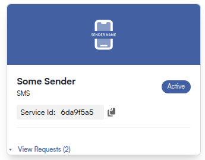

This API enables you to send messages to recipients efficiently while allowing
management and monitoring of message delivery through callbacks.

## Prerequisites

Before you begin, ensure you have:

- A valid and active **Service** - You can get one by visiting the [Services](https://cloud.belio.co.ke/services) page
- There are two ways to get **Service ID**
    - Use the [Service](/service) endpoint to list all services and retrieve the ID of the specific one you intend to use
    - Go to the [Services page](https://stage-cloud.belio.co.ke/services/) and copy the ID by clicking on the copy file icon as shown in the image below.
        
- **API Client Authorization** - This endpoint requires the `mobilize.sms.send.oneway` API client authorization scope to send one way messages. You can set up scopes on the [API Clients](https://cloud.belio.co.ke/team-overview/api-access-keys) page

## Advanced Features

For enhanced functionality, you can include an optional `receiptRequest` in
the request body. This feature allows you to receive delivery receipts for the messages
you send, enabling you to track their status and confirm successful delivery. The
`receiptRequest` object includes the following fields:

- **correlator**: A unique string to correlate the delivery receipt with the original message.
- **callbackUrl**: A URL where the delivery receipt will be sent.

```bash
curl --request POST \
  --url https://api.belio.co.ke/message/{serviceId} \
  --header 'Authorization: Bearer <token>' \
  --header 'Content-Type: application/json' \
  --data '{
    ...
  "receiptRequest": {
    "correlator": "<string>",
    "callbackUrl": "<string>"
  }
}'
```

By leveraging these features, you can ensure reliable message delivery and gain valuable
insights into the status of your communications.
