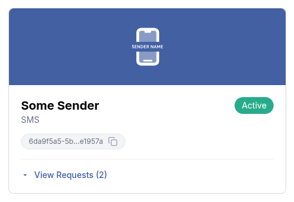
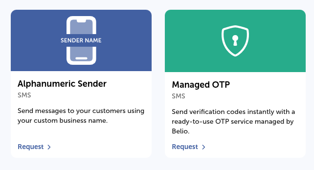

This API enables you to send messages to recipients efficiently while allowing
management and monitoring of message delivery through callbacks.

## Prerequisites

Before you begin, ensure you have:

- A valid and active sms service - You can get one by visiting the [Services](https://cloud.belio.co.ke/services) page
- There are two ways to get a service ID:
  1. Use the [List Services](/service/list) endpoint to list all services and retrieve the ID of the specific one you intend to use
  2. Go to the [Services](https://cloud.belio.co.ke/services) page and copy the ID by clicking on the copy file icon as shown in
the image below.

- API client authorization - This endpoint requires the `message.sms.send.oneway` API client authorization scope to send one way
sms messages. You can set up scopes on the [API Clients](https://cloud.belio.co.ke/team-overview/api-access-keys) page.

## Sender Types

SMS messages are sent using one of two sender types:

- **Alphanumeric Sender** is a custom, branded sender name you request for your team. Once approved, it's yours to use freely for any message content.
- **Belio-managed sender** is a ready-to-use sender owned and operated by Belio (e.g. Managed OTP), intended for a specific purpose such as authentication. Because Belio owns and is responsible for these senders, their use is restricted to that purpose, and messages sent through them require additional approval. See [Templates](/messaging/sms/templates/introduction) for how this applies to template-based sends.

You can request either sender type from the [Services](https://cloud.belio.co.ke/services/services-menu) page.



## Advanced Features

For enhanced functionality, you can include an optional `receiptRequest` in
the request body. This feature allows you to receive delivery receipts for the messages
you send, enabling you to track their status and confirm a successful delivery. The
`receiptRequest` object includes the following fields:

- **correlator**: A unique string to correlate the delivery receipt with the original message.
- **callbackUrl**: A URL where the delivery receipt will be sent.

```bash
curl --request POST \
  --url https://api.belio.co.ke/message/{serviceId} \
  --header 'Authorization: Bearer <token>' \
  --header 'Content-Type: application/json' \
  --data '{
    ...
  "receiptRequest": {
    "correlator": "<string>",
    "callbackUrl": "<string>"
  }
}'
```

By leveraging these features, you can ensure reliable message delivery and gain valuable
insights into the status of your communications.