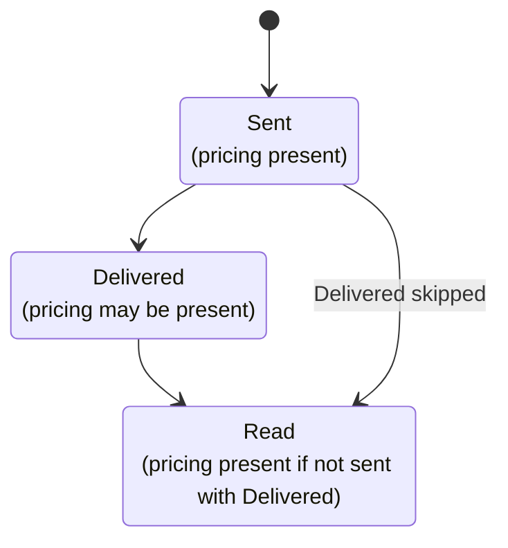
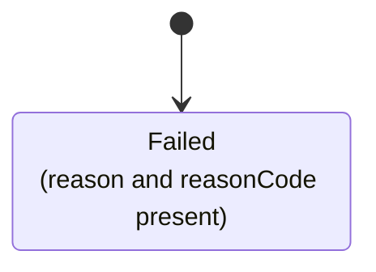

Delivery receipts are callback events for WhatsApp messages sent through the API.
When a request includes `receiptRequest`, the platform sends HTTP `POST` requests to the configured
`callbackUrl` with `Content-Type: application/json`.

<Note>
  Ensure that the callback URL is publicly accessible and can handle
  unauthenticated HTTP POST requests.
</Note>

### Receipt Request

An optional object on send requests that enables delivery status callbacks.
It must be included in the WhatsApp message request body when sending a message to receive delivery receipts for that message.

```json
{
  "correlator": "12345678-1234-5678-1234-567812345678",
  "callbackUrl": "https://acme.org/whatsapp/delivery-reports"
}
```

| Field         | Type   | Constraints                                                                                                    |
| ------------- | ------ | -------------------------------------------------------------------------------------------------------------- |
| `correlator`  | string | Non-empty, maximum 100 characters. Used to correlate callbacks to the originating request. `UUID` recommended. |
| `callbackUrl` | string | Valid `https://` or `http://` URL. The endpoint must not require authentication.                               |

<Warning>
  When provided, both fields are required. An invalid `receiptRequest` causes
  the entire request to be rejected with `400 Bad Request` before any messages
  are dispatched.
</Warning>

### Outbound Receipts

Sent when the delivery status of a message you sent to a user changes. A single sent message can produce multiple
callbacks in sequence: `Sent`, `Delivered`, then `Read` or `Played` for voice messages. A failed message produces a `Failed` callback.

### Fields

| Field            | Type   | Always present | Description                                                                                                                                                                   |
| ---------------- | ------ | -------------- | ----------------------------------------------------------------------------------------------------------------------------------------------------------------------------- |
| `type`           | string | Yes            | Always `WhatsAppOutboundMessageReceipt`                                                                                                                                       |
| `wabaId`         | string | Yes            | WhatsApp Business Account ID.                                                                                                                                                 |
| `phoneNumberId`  | string | Yes            | WhatsApp Business Account Phone Number ID.                                                                                                                                    |
| `wamId`          | string | No             | WhatsApp message ID assigned by Meta. Omitted for `Failed` status when termination to Meta was not successful.                                                                |
| `correlator`     | string | Yes            | Unique ID that correlates with the original message request.                                                                                                                  |
| `phone`          | string | Yes            | Recipient's phone number.                                                                                                                                                     |
| `timestamp`      | string | Yes            | ISO 8601 timestamp for when the status event occurred, in UTC.                                                                                                                |
| `deliveryStatus` | string | Yes            | Current delivery state. See [Delivery Status](#delivery-status-values) values.                                                                                                |
| `pricing`        | object | No             | [Pricing type](#pricing-type-values) and [category](#pricing-category-values). Present on `Sent` and on one of either `Delivered` or `Read`, not both, and never on `Failed`. |
| `reason`         | string | No             | Human-readable error description. Only present when `deliveryStatus` is `Failed`.                                                                                             |
| `reasonCode`     | string | No             | Numeric error code as a string. Only present when `deliveryStatus` is `Failed`.                                                                                               |

### Delivery Status Values

| Value       | WhatsApp UI         | Meaning                                                                        |
| ----------- | ------------------- | ------------------------------------------------------------------------------ |
| `Waiting`   | Clock icon          | Message is being processed and has not yet been sent to the recipient's device |
| `Sent`      | Single checkmark    | Message sent from Meta's servers to the recipient                              |
| `Delivered` | Two checkmarks      | Message delivered to the recipient's device                                    |
| `Read`      | Two blue checkmarks | Message displayed in an open chat on the recipient's device                    |
| `Played`    | Blue microphone     | Voice message played by the recipient                                          |
| `Failed`    | Red error triangle  | Message could not be sent or delivered                                         |
| `Uncertain` | -                   | Delivery outcome is unknown; the message may or may not have been delivered    |

### Pricing Type Values

| Value                 | Description                                                                                                                                                                                                                                                                                                 |
| --------------------- | ----------------------------------------------------------------------------------------------------------------------------------------------------------------------------------------------------------------------------------------------------------------------------------------------------------- |
| `Regular`             | Message is billable.                                                                                                                                                                                                                                                                                        |
| `FreeCustomerService` | Message is free because it was either a utility template message or non-template message sent within a customer service window (A 24-hour window opened when a WhatsApp user messages or calls your Business. Each new message or call from the user resets the window, extending it for another 24 hours). |
| `FreeEntryPoint`      | Message is free because it was sent within an open free entry point window (A 72-hr window opened when a WhatsApp user starts a conversation through click-to-WhatsApp ads or Facebook Page call-to-action buttons).                                                                                        |

### Pricing Category Values

| Value                         | Description                                         |
| ----------------------------- | --------------------------------------------------- |
| `Authentication`              | Authentication message                              |
| `AuthenticationInternational` | Authentication message billed at international rate |
| `Marketing`                   | Marketing message                                   |
| `MarketingLite`               | Marketing Messages API message                      |
| `ReferralConversation`        | Free entry point conversation                       |
| `Service`                     | Service message                                     |
| `Utility`                     | Utility message                                     |

#### Examples

- Delivered

```json
{
  "type": "WhatsAppOutboundMessageReceipt",
  "wabaId": "102290129340398",
  "phoneNumberId": "106540352242922",
  "wamId": "wamid.HBgLMTY1MDM4Nzk0MzkVAgASGBQzQUFERjg0NDEzNDdFODU3MUMxMAA=",
  "correlator": "8f24c8c6-7e7c-4b6f-a622-d4a25f91d3c1",
  "phone": "254700111213",
  "timestamp": "2025-05-11T10:31:13Z",
  "deliveryStatus": "Delivered",
  "pricing": {
    "type": "Regular",
    "category": "Marketing"
  }
}
```

- Failed

```json
{
  "type": "WhatsAppOutboundMessageReceipt",
  "wabaId": "102290129340398",
  "phoneNumberId": "106540352242922",
  "wamId": "wamid.HBgLMTY1MDM4Nzk0MzkVAgARGBI0QUQ2MjA4NEYyRkExNjMyREUA",
  "correlator": "8f24c8c6-7e7c-4b6f-a622-d4a25f91d3c1",
  "phone": "254700111213",
  "timestamp": "2025-05-11T10:35:00Z",
  "deliveryStatus": "Failed",
  "reason": "This message was not delivered to maintain healthy ecosystem engagement.",
  "reasonCode": "131049"
}
```

### Callback Sequence

Each `deliveryStatus` transition triggers an HTTP `POST` to your `callbackUrl`.

**Successful delivery** — up to three callbacks in order (`Sent` → `Delivered` → `Read`):



**Failed delivery** — a single terminal callback:



<Note>
  If a message is delivered and read at the same time, for example when the
  recipient has the chat open, the `Delivered` callback is skipped and only
  `Read` is sent.
</Note>
