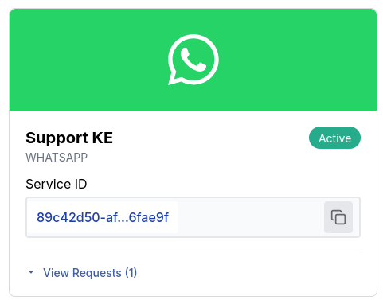

---
Introduction
---

The WhatsApp Messaging API allows you to send template-based messages to users via a configured WhatsApp Business Account (WABA).
This endpoint is designed for reliable, scalable communication, supporting both bulk messaging and personalized
messaging workflows using pre-approved WhatsApp templates.

## Prerequisites
To use the WhatsApp Messaging API, you need to have the following prerequisites in place:
1. **WhatsApp Service** : You must have an active and valid WhatsApp Business service. Visit [Service requests](https://cloud.belio.co.ke/services/services-menu)
to create a service.
    - There are two ways to get a service ID once you have created a service:
      1. Use the [List Services](../../service/list) endpoint to list all services and retrieve the ID of the specific one you intend to use
      2. Go to the [Services](https://cloud.belio.co.ke/services) page and copy the ID by clicking on the copy file icon as shown in
        the image below.
        
2. **WhatsApp Business Account (WABA)**: You must have a WhatsApp Business Account set up and configured.
This includes having a verified phone number and a display name that adheres to WhatsApp's guidelines.
3. **Approved Message Templates**: You need to create and get approval for message templates that you intend to use for sending messages.
These templates must comply with WhatsApp's policies and guidelines. Check [WhatsApp Business Messaging policy](https://whatsappbusiness.com/policy/).
4. **API client authorization**: This endpoint requires the `message.whatsapp.send.oneway` API client authorization scope to send one way
WhatsApp messages. You can set up scopes on the [API Clients](https://cloud.belio.co.ke/team-overview/api-access-keys) page.

## Advanced Features
The WhatsApp Messaging API supports advanced features such as message scheduling, media attachments, and interactive message templates.
- **Media Attachments**: You can include media attachments such as images, videos, and documents in your messages to enhance engagement and provide richer content.
- **Interactive Message Templates**: You can use interactive message templates that include buttons and quick replies to encourage user interaction and improve response rates.
- **Receipt requests** : For enhanced functionality, you can include an optional `receiptRequest` in
the request body. This feature allows you to receive delivery receipts for the messages
you send, enabling you to track their status and confirm successful delivery. The
`receiptRequest` object includes the following fields:

    - **correlator**: A unique string to correlate the delivery receipt with the original message.
    - **callbackUrl**: A URL where the delivery receipt will be sent.

    ```bash
    curl --request POST \
      --url https://api.belio.co.ke/message/{serviceId}/whatsapp \
      --header 'Authorization: Bearer <token>' \
      --header 'Content-Type: application/json' \
      --data '{
        ...
      "receiptRequest": {
        "correlator": "<string>",
        "callbackUrl": "<string>"
      }
    }'
    ```

By leveraging these features, you can create engaging and effective messaging campaigns that resonate with your audience and drive better results.

