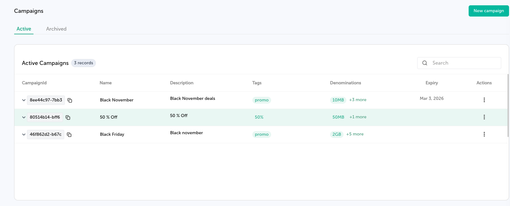

The Mobile Data Disbursement API enables secure provisioning of mobile data bundles to one or multiple recipients. This endpoint supports both bulk distribution scenarios and individualized allocations while maintaining the same authentication and access control used across all Belio API services.

## Prerequisites

Before using this endpoint, ensure you have:

- An active **Campaign** for mobile data disbursement — available from the [Campaigns](https://cloud.belio.co.ke/mobile-data/campaigns) page.
- There are two ways to get *CampaignId*
    -  Go to the  [Campaigns](https://cloud.belio.co.ke/mobile-data/campaigns) page and copy the id by clicking the copy icon on the table as shown on the photo below.
        -  
    - Call the [List Campaigns](/campaign/list) endpoint to retrieve all available campaigns and their IDs.

- **API Client Authorization** — Ensure your API Client includes permission to perform mobile data disbursement.
Permissions can be managed from the [API Clients](https://cloud.belio.co.ke/team-overview/api-access-keys) page.

---

## Optional Delivery Tracking

You may include an optional `receiptRequest` object in the request body to receive webhook notifications when a disbursement attempt completes. This enables tracking of delivery outcomes per recipient.

The `receiptRequest` object includes:

- **correlator** — A unique client-defined identifier used to correlate the delivery receipt with the original request.
- **callbackUrl** — A publicly accessible URL where delivery receipts will be pushed.

---

### Example Using `curl`

```bash
curl --request POST \
  --url https://api.belio.co.ke/data/{campaignId} \
  --header 'Authorization: Bearer <token>' \
  --header 'Content-Type: application/json' \
  --data '{
    ...
    "receiptRequest": {
      "correlator": "<unique-id>",
      "callbackUrl": "https://example.org/webhook"
    }
  }'
```

---

By using the Mobile Data Disbursement API, you can automate bandwidth provisioning workflows, enable bulk allocations, and maintain traceability through correlators and callback receipts—ensuring a reliable and auditable delivery process.
