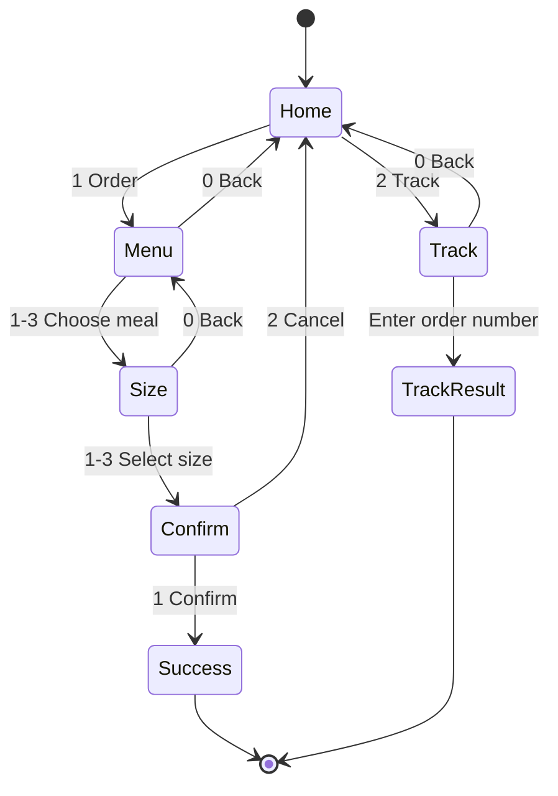

This guide shows how to run a simple USSD menu app on your own server using a Belio callback endpoint.

Belio will call your server whenever a subscriber dials your shortcode and presses keys on their phone. Your job is only to:

1. Receive the JSON request.
2. Read the full `inputs` history.
3. Return the next screen as JSON.


## Belio Eats Flow

This demo implements a small menu modeling a fast-food restaurant.

- Home
  - `1. Order Food`
  - `2. Track Order`
- Order Food
  - `1. Nyama Choma`
  - `2. Pilau Beef`
  - `3. Fried Tilapia`
  - then: Quarter / Half / Full → Confirm → Done
- Track Order
  - enter order number → status → Done

### Screens

| Screen       | User sees             | Next step               |
|--------------|-----------------------|-------------------------|
| Home         | Order / Track         | `1` or `2`              |
| Menu         | Choose meal           | `1-3`, or `0` back      |
| Size         | Quarter / Half / Full | `1-3`, or `0` back      |
| Confirm      | Place or cancel       | `1` confirm, `2` cancel |
| Success      | Thank you             | session ends (`END`)    |
| Track        | Type order number     | any text, or `0` back   |
| Track result | Fake status           | session ends (`END`)    |



## Language Examples

<Tabs>
  <Tab title="TypeScript">

## TypeScript Example

### Prerequisites

- Node.js 18+
- A terminal

### Create the project

```bash
# create a new directory and initialize a Node.js project
mkdir belio-eats-ussd && cd belio-eats-ussd
npm init -y
npm install express
npm install -D typescript tsx @types/express @types/node
npx tsc --init
```

### `src/server.ts`

```ts
import express, { Request, Response } from "express";

type UssdRequest = {
  type?: string;
  sessionId: string;
  msisdn: string;
  code: string;
  inputs: string[];
};

type UssdResponse = {
  message: string;
  action: "CON" | "END";
};

const app = express();
app.use(express.json());

function reply(message: string, action: "CON" | "END" = "CON"): UssdResponse {
  return { message, action };
}

function handleBelioEats(inputs: string[]): UssdResponse {
  if (inputs.length === 0) {
    return reply("Welcome to Belio Eats!\n\n1. Order Food\n2. Track Order");
  }

  const [first, ...rest] = inputs;

  if (first === "1") {
    return handleOrder(rest);
  }

  if (first === "2") {
    return handleTrack(rest);
  }

  return reply("Welcome to Belio Eats!\n\n1. Order Food\n2. Track Order");
}

function handleOrder(inputs: string[]): UssdResponse {
  if (inputs.length === 0) {
    return reply(
      "Choose a meal:\n\n1. Nyama Choma - KES 450\n2. Pilau Beef - KES 350\n3. Fried Tilapia - KES 550\n\n0. Back"
    );
  }

  const [mealChoice, ...rest] = inputs;

  if (mealChoice === "0") {
    return reply("Welcome to Belio Eats!\n\n1. Order Food\n2. Track Order");
  }

  const meals: Record<string, string> = {
    "1": "Nyama Choma",
    "2": "Pilau Beef",
    "3": "Fried Tilapia",
  };

  const meal = meals[mealChoice];
  if (!meal) {
    return reply(
      "Choose a meal:\n\n1. Nyama Choma - KES 450\n2. Pilau Beef - KES 350\n3. Fried Tilapia - KES 550\n\n0. Back"
    );
  }

  return handleSize(meal, rest);
}

function handleSize(meal: string, inputs: string[]): UssdResponse {
  if (inputs.length === 0) {
    return reply(
      `Choose a portion for ${meal}:\n\n1. Quarter\n2. Half\n3. Full\n\n0. Back`
    );
  }

  const [sizeChoice, ...rest] = inputs;

  if (sizeChoice === "0") {
    return handleOrder([]);
  }

  const sizes: Record<string, string> = {
    "1": "Quarter",
    "2": "Half",
    "3": "Full",
  };

  const size = sizes[sizeChoice];
  if (!size) {
    return reply(
      `Choose a portion for ${meal}:\n\n1. Quarter\n2. Half\n3. Full\n\n0. Back`
    );
  }

  return handleConfirm(meal, size, rest);
}

function handleConfirm(
  meal: string,
  size: string,
  inputs: string[]
): UssdResponse {
  if (inputs.length === 0) {
    return reply(
      `Confirm order:\n\n1x ${meal} (${size})\nPay: M-Pesa\n\n1. Place order\n2. Cancel`
    );
  }

  const [choice] = inputs;

  if (choice === "1") {
    return reply(
      `Order confirmed! Thank you.\n\n${meal} (${size})\nRef: ORD-100245\n\nYou'll receive SMS updates.`,
      "END"
    );
  }

  if (choice === "2") {
    return reply("Welcome to Belio Eats!\n\n1. Order Food\n2. Track Order");
  }

  return reply(
    `Confirm order:\n\n1x ${meal} (${size})\nPay: M-Pesa\n\n1. Place order\n2. Cancel`
  );
}

function handleTrack(inputs: string[]): UssdResponse {
  if (inputs.length === 0) {
    return reply("Enter your order number:\n\n(Format: ORD-123456)\n\n0. Back");
  }

  const [orderNumber] = inputs;

  if (orderNumber === "0") {
    return reply("Welcome to Belio Eats!\n\n1. Order Food\n2. Track Order");
  }

  return reply(
    `Order ${orderNumber}\n\nStatus: Out for delivery\nRider: Otieno O.\nETA: 15 mins\n\nEnjoy your meal!`,
    "END"
  );
}

app.post("/ussd/callback", (req: Request, res: Response) => {
  const body = req.body as UssdRequest;
  const inputs = Array.isArray(body.inputs) ? body.inputs : [];

  console.log("USSD request", {
    sessionId: body.sessionId,
    msisdn: body.msisdn,
    inputs,
  });

  const response = handleBelioEats(inputs);
  res.status(200).json(response);
});

const PORT = process.env.PORT || 3000;
app.listen(PORT, () => {
  console.log(`Belio Eats USSD callback listening on http://localhost:${PORT}`);
  console.log(`POST http://localhost:${PORT}/ussd/callback`);
});
```

### Run it

Add this script to `package.json`:

```json
{
  "scripts": {
    "dev": "tsx src/server.ts"
  }
}
```

Then run:

```bash
npm run dev
```

  </Tab>
  <Tab title="Python">

## Python Example

### Prerequisites

- Python 3.10+
- A terminal

### Create the project

```bash
mkdir belio-eats-ussd-py && cd belio-eats-ussd-py
python3 -m venv .venv
source .venv/bin/activate
pip install flask
```

### `app.py`

```py
from flask import Flask, jsonify, request

app = Flask(__name__)


def reply(message: str, action: str = "CON") -> dict:
    return {"message": message, "action": action}


def handle_belio_eats(inputs: list[str]) -> dict:
    if not inputs:
        return reply("Welcome to Belio Eats!\n\n1. Order Food\n2. Track Order")

    first, *rest = inputs

    if first == "1":
        return handle_order(rest)

    if first == "2":
        return handle_track(rest)

    return reply("Welcome to Belio Eats!\n\n1. Order Food\n2. Track Order")


def handle_order(inputs: list[str]) -> dict:
    menu = (
        "Choose a meal:\n\n"
        "1. Nyama Choma - KES 450\n"
        "2. Pilau Beef - KES 350\n"
        "3. Fried Tilapia - KES 550\n\n"
        "0. Back"
    )

    if not inputs:
        return reply(menu)

    meal_choice, *rest = inputs

    if meal_choice == "0":
        return reply("Welcome to Belio Eats!\n\n1. Order Food\n2. Track Order")

    meals = {
        "1": "Nyama Choma",
        "2": "Pilau Beef",
        "3": "Fried Tilapia",
    }
    meal = meals.get(meal_choice)
    if not meal:
        return reply(menu)

    return handle_size(meal, rest)


def handle_size(meal: str, inputs: list[str]) -> dict:
    menu = f"Choose a portion for {meal}:\n\n1. Quarter\n2. Half\n3. Full\n\n0. Back"

    if not inputs:
        return reply(menu)

    size_choice, *rest = inputs

    if size_choice == "0":
        return handle_order([])

    sizes = {"1": "Quarter", "2": "Half", "3": "Full"}
    size = sizes.get(size_choice)
    if not size:
        return reply(menu)

    return handle_confirm(meal, size, rest)


def handle_confirm(meal: str, size: str, inputs: list[str]) -> dict:
    menu = (
        f"Confirm order:\n\n1x {meal} ({size})\nPay: M-Pesa\n\n"
        "1. Place order\n2. Cancel"
    )

    if not inputs:
        return reply(menu)

    choice = inputs[0]

    if choice == "1":
        return reply(
            f"Order confirmed! Thank you.\n\n{meal} ({size})\n"
            "Ref: ORD-100245\n\nYou'll receive SMS updates.",
            "END",
        )

    if choice == "2":
        return reply("Welcome to Belio Eats!\n\n1. Order Food\n2. Track Order")

    return reply(menu)


def handle_track(inputs: list[str]) -> dict:
    if not inputs:
        return reply("Enter your order number:\n\n(Format: ORD-123456)\n\n0. Back")

    order_number = inputs[0]

    if order_number == "0":
        return reply("Welcome to Belio Eats!\n\n1. Order Food\n2. Track Order")

    return reply(
        f"Order {order_number}\n\n"
        "Status: Out for delivery\n"
        "Rider: Otieno O.\n"
        "ETA: 15 mins\n\n"
        "Enjoy your meal!",
        "END",
    )


@app.post("/ussd/callback")
def ussd_callback():
    body = request.get_json(silent=True) or {}
    inputs = body.get("inputs") or []
    if not isinstance(inputs, list):
        inputs = []

    print("USSD request", {
        "sessionId": body.get("sessionId"),
        "msisdn": body.get("msisdn"),
        "inputs": inputs,
    })

    return jsonify(handle_belio_eats(inputs))


if __name__ == "__main__":
    print("Belio Eats USSD callback on http://localhost:3000/ussd/callback")
    app.run(host="0.0.0.0", port=3000, debug=True)
```

### Run it

```bash
python app.py
```

  </Tab>
  <Tab title="Scala">

## Scala Example

### `build.sbt`

```scala
ThisBuild / scalaVersion := "2.13.14"

libraryDependencies ++= Seq(
  "org.apache.pekko" %% "pekko-actor-typed" % "1.1.2",
  "org.apache.pekko" %% "pekko-stream" % "1.1.2",
  "org.apache.pekko" %% "pekko-http" % "1.1.0",
  "io.spray" %% "spray-json" % "1.3.6"
)
```

### `src/main/scala/Main.scala`

```scala
import pekko.actor.typed.ActorSystem
import pekko.http.scaladsl.Http
import pekko.http.scaladsl.model._
import pekko.http.scaladsl.server.Directives._
import pekko.stream.SystemMaterializer
import spray.json._

import scala.concurrent.ExecutionContextExecutor

final case class UssdRequest(
  `type`: Option[String],
  sessionId: String,
  msisdn: String,
  code: String,
  inputs: List[String]
)

final case class UssdResponse(message: String, action: String)

trait JsonSupport extends DefaultJsonProtocol {
  implicit val reqFormat = jsonFormat5(UssdRequest)
  implicit val resFormat = jsonFormat2(UssdResponse)
}

object Main extends App with JsonSupport {
  implicit val system: ActorSystem[Nothing] = ActorSystem(akka.actor.typed.scaladsl.Behaviors.empty, "belio-eats")
  implicit val ec: ExecutionContextExecutor = system.executionContext
  implicit val materializer = SystemMaterializer(system).materializer

  def reply(message: String, action: String = "CON"): UssdResponse =
    UssdResponse(message, action)

  def handle(inputs: List[String]): UssdResponse =
    inputs match {
      case Nil => reply("Welcome to Belio Eats!\n\n1. Order Food\n2. Track Order")
      case "1" :: rest => handleOrder(rest)
      case "2" :: rest => handleTrack(rest)
      case _ => reply("Welcome to Belio Eats!\n\n1. Order Food\n2. Track Order")
    }

  def handleOrder(inputs: List[String]): UssdResponse = inputs match {
    case Nil =>
      reply("Choose a meal:\n\n1. Nyama Choma - KES 450\n2. Pilau Beef - KES 350\n3. Fried Tilapia - KES 550\n\n0. Back")
    case "0" :: _ =>
      reply("Welcome to Belio Eats!\n\n1. Order Food\n2. Track Order")
    case "1" :: rest => handleSize("Nyama Choma", rest)
    case "2" :: rest => handleSize("Pilau Beef", rest)
    case "3" :: rest => handleSize("Fried Tilapia", rest)
    case _ =>
      reply("Choose a meal:\n\n1. Nyama Choma - KES 450\n2. Pilau Beef - KES 350\n3. Fried Tilapia - KES 550\n\n0. Back")
  }

  def handleSize(meal: String, inputs: List[String]): UssdResponse = inputs match {
    case Nil =>
      reply(s"Choose a portion for $meal:\n\n1. Quarter\n2. Half\n3. Full\n\n0. Back")
    case "0" :: _ =>
      reply("Welcome to Belio Eats!\n\n1. Order Food\n2. Track Order")
    case "1" :: rest => handleConfirm(meal, "Quarter", rest)
    case "2" :: rest => handleConfirm(meal, "Half", rest)
    case "3" :: rest => handleConfirm(meal, "Full", rest)
    case _ =>
      reply(s"Choose a portion for $meal:\n\n1. Quarter\n2. Half\n3. Full\n\n0. Back")
  }

  def handleConfirm(meal: String, size: String, inputs: List[String]): UssdResponse = inputs match {
    case Nil =>
      reply(s"Confirm order:\n\n1x $meal ($size)\nPay: M-Pesa\n\n1. Place order\n2. Cancel")
    case "1" :: _ =>
      reply(s"Order confirmed! Thank you.\n\n$meal ($size)\nRef: ORD-100245\n\nYou'll receive SMS updates.", "END")
    case "2" :: _ =>
      reply("Welcome to Belio Eats!\n\n1. Order Food\n2. Track Order")
    case _ =>
      reply(s"Confirm order:\n\n1x $meal ($size)\nPay: M-Pesa\n\n1. Place order\n2. Cancel")
  }

  def handleTrack(inputs: List[String]): UssdResponse = inputs match {
    case Nil =>
      reply("Enter your order number:\n\n(Format: ORD-123456)\n\n0. Back")
    case "0" :: _ =>
      reply("Welcome to Belio Eats!\n\n1. Order Food\n2. Track Order")
    case order :: _ =>
      reply(s"Order $order\n\nStatus: Out for delivery\nRider: Otieno O.\nETA: 15 mins\n\nEnjoy your meal!", "END")
  }

  val route =
    path("ussd" / "callback") {
      post {
        entity(as[String]) { raw =>
          val json = raw.parseJson.convertTo[UssdRequest]
          println(s"USSD request ${json.sessionId} ${json.msisdn} ${json.inputs.mkString(",")}")
          complete(HttpEntity(ContentTypes.`application/json`, handle(json.inputs).toJson.compactPrint))
        }
      }
    }

  Http().newServerAt("0.0.0.0", 3000).bind(route)
}
```

  </Tab>
  <Tab title="Java">

## Java Example

### `pom.xml`

```xml
<project xmlns="http://maven.apache.org/POM/4.0.0" xmlns:xsi="http://www.w3.org/2001/XMLSchema-instance"
  xsi:schemaLocation="http://maven.apache.org/POM/4.0.0 http://maven.apache.org/xsd/maven-4.0.0.xsd">
  <modelVersion>4.0.0</modelVersion>
  <groupId>ke.belio</groupId>
  <artifactId>belio-eats-ussd</artifactId>
  <version>1.0.0</version>
  <properties>
    <maven.compiler.source>17</maven.compiler.source>
    <maven.compiler.target>17</maven.compiler.target>
  </properties>
  <dependencies>
    <dependency>
      <groupId>org.springframework.boot</groupId>
      <artifactId>spring-boot-starter-web</artifactId>
      <version>3.3.2</version>
    </dependency>
  </dependencies>
</project>
```

### `src/main/java/ke/belio/UssdApplication.java`

```java
package ke.belio;

import java.util.List;
import java.util.Map;

import org.springframework.boot.SpringApplication;
import org.springframework.boot.autoconfigure.SpringBootApplication;
import org.springframework.http.MediaType;
import org.springframework.web.bind.annotation.PostMapping;
import org.springframework.web.bind.annotation.RequestBody;
import org.springframework.web.bind.annotation.RestController;

@SpringBootApplication
public class UssdApplication {
  public static void main(String[] args) {
    SpringApplication.run(UssdApplication.class, args);
  }

  record UssdRequest(String type, String sessionId, String msisdn, String code, List<String> inputs) {}
  record UssdResponse(String message, String action) {}

  @RestController
  class UssdController {
    @PostMapping(value = "/ussd/callback", consumes = MediaType.APPLICATION_JSON_VALUE, produces = MediaType.APPLICATION_JSON_VALUE)
    public UssdResponse callback(@RequestBody UssdRequest request) {
      System.out.println("USSD request " + request.sessionId() + " " + request.msisdn() + " " + request.inputs());
      return handle(request.inputs());
    }

    private UssdResponse reply(String message) {
      return new UssdResponse(message, "CON");
    }

    private UssdResponse reply(String message, String action) {
      return new UssdResponse(message, action);
    }

    private UssdResponse handle(List<String> inputs) {
      if (inputs == null || inputs.isEmpty()) {
        return reply("Welcome to Belio Eats!\n\n1. Order Food\n2. Track Order");
      }

      var first = inputs.get(0);
      var rest = inputs.subList(1, inputs.size());

      return switch (first) {
        case "1" -> handleOrder(rest);
        case "2" -> handleTrack(rest);
        default -> reply("Welcome to Belio Eats!\n\n1. Order Food\n2. Track Order");
      };
    }

    private UssdResponse handleOrder(List<String> inputs) {
      if (inputs.isEmpty()) {
        return reply("Choose a meal:\n\n1. Nyama Choma - KES 450\n2. Pilau Beef - KES 350\n3. Fried Tilapia - KES 550\n\n0. Back");
      }
      var choice = inputs.get(0);
      var rest = inputs.subList(1, inputs.size());
      if ("0".equals(choice)) return reply("Welcome to Belio Eats!\n\n1. Order Food\n2. Track Order");
      return switch (choice) {
        case "1" -> handleSize("Nyama Choma", rest);
        case "2" -> handleSize("Pilau Beef", rest);
        case "3" -> handleSize("Fried Tilapia", rest);
        default -> reply("Choose a meal:\n\n1. Nyama Choma - KES 450\n2. Pilau Beef - KES 350\n3. Fried Tilapia - KES 550\n\n0. Back");
      };
    }

    private UssdResponse handleSize(String meal, List<String> inputs) {
      if (inputs.isEmpty()) return reply("Choose a portion for " + meal + ":\n\n1. Quarter\n2. Half\n3. Full\n\n0. Back");
      var choice = inputs.get(0);
      var rest = inputs.subList(1, inputs.size());
      if ("0".equals(choice)) return reply("Welcome to Belio Eats!\n\n1. Order Food\n2. Track Order");
      return switch (choice) {
        case "1" -> handleConfirm(meal, "Quarter", rest);
        case "2" -> handleConfirm(meal, "Half", rest);
        case "3" -> handleConfirm(meal, "Full", rest);
        default -> reply("Choose a portion for " + meal + ":\n\n1. Quarter\n2. Half\n3. Full\n\n0. Back");
      };
    }

    private UssdResponse handleConfirm(String meal, String size, List<String> inputs) {
      if (inputs.isEmpty()) return reply("Confirm order:\n\n1x " + meal + " (" + size + ")\nPay: M-Pesa\n\n1. Place order\n2. Cancel");
      return switch (inputs.get(0)) {
        case "1" -> reply("Order confirmed! Thank you.\n\n" + meal + " (" + size + ")\nRef: ORD-100245\n\nYou'll receive SMS updates.", "END");
        case "2" -> reply("Welcome to Belio Eats!\n\n1. Order Food\n2. Track Order");
        default -> reply("Confirm order:\n\n1x " + meal + " (" + size + ")\nPay: M-Pesa\n\n1. Place order\n2. Cancel");
      };
    }

    private UssdResponse handleTrack(List<String> inputs) {
      if (inputs.isEmpty()) return reply("Enter your order number:\n\n(Format: ORD-123456)\n\n0. Back");
      if ("0".equals(inputs.get(0))) return reply("Welcome to Belio Eats!\n\n1. Order Food\n2. Track Order");
      return reply("Order " + inputs.get(0) + "\n\nStatus: Out for delivery\nRider: Otieno O.\nETA: 15 mins\n\nEnjoy your meal!", "END");
    }
  }
}
```

  </Tab>
  <Tab title="Go">

## Go Example

### `main.go`

```go
package main

import (
  "encoding/json"
  "fmt"
  "log"
  "net/http"
)

type UssdRequest struct {
  Type      string   `json:"type"`
  SessionID string   `json:"sessionId"`
  Msisdn    string   `json:"msisdn"`
  Code      string   `json:"code"`
  Inputs    []string `json:"inputs"`
}

type UssdResponse struct {
  Message string `json:"message"`
  Action  string `json:"action"`
}

func reply(message string, action string) UssdResponse {
  if action == "" {
    action = "CON"
  }
  return UssdResponse{Message: message, Action: action}
}

func handle(inputs []string) UssdResponse {
  if len(inputs) == 0 {
    return reply("Welcome to Belio Eats!\n\n1. Order Food\n2. Track Order", "CON")
  }
  switch inputs[0] {
  case "1":
    return handleOrder(inputs[1:])
  case "2":
    return handleTrack(inputs[1:])
  default:
    return reply("Welcome to Belio Eats!\n\n1. Order Food\n2. Track Order", "CON")
  }
}

func handleOrder(inputs []string) UssdResponse {
  menu := "Choose a meal:\n\n1. Nyama Choma - KES 450\n2. Pilau Beef - KES 350\n3. Fried Tilapia - KES 550\n\n0. Back"
  if len(inputs) == 0 {
    return reply(menu, "CON")
  }
  switch inputs[0] {
  case "0":
    return reply("Welcome to Belio Eats!\n\n1. Order Food\n2. Track Order", "CON")
  case "1":
    return handleSize("Nyama Choma", inputs[1:])
  case "2":
    return handleSize("Pilau Beef", inputs[1:])
  case "3":
    return handleSize("Fried Tilapia", inputs[1:])
  default:
    return reply(menu, "CON")
  }
}

func handleSize(meal string, inputs []string) UssdResponse {
  menu := fmt.Sprintf("Choose a portion for %s:\n\n1. Quarter\n2. Half\n3. Full\n\n0. Back", meal)
  if len(inputs) == 0 {
    return reply(menu, "CON")
  }
  switch inputs[0] {
  case "0":
    return reply("Welcome to Belio Eats!\n\n1. Order Food\n2. Track Order", "CON")
  case "1":
    return handleConfirm(meal, "Quarter", inputs[1:])
  case "2":
    return handleConfirm(meal, "Half", inputs[1:])
  case "3":
    return handleConfirm(meal, "Full", inputs[1:])
  default:
    return reply(menu, "CON")
  }
}

func handleConfirm(meal, size string, inputs []string) UssdResponse {
  menu := fmt.Sprintf("Confirm order:\n\n1x %s (%s)\nPay: M-Pesa\n\n1. Place order\n2. Cancel", meal, size)
  if len(inputs) == 0 {
    return reply(menu, "CON")
  }
  switch inputs[0] {
  case "1":
    return reply(fmt.Sprintf("Order confirmed! Thank you.\n\n%s (%s)\nRef: ORD-100245\n\nYou'll receive SMS updates.", meal, size), "END")
  case "2":
    return reply("Welcome to Belio Eats!\n\n1. Order Food\n2. Track Order", "CON")
  default:
    return reply(menu, "CON")
  }
}

func handleTrack(inputs []string) UssdResponse {
  if len(inputs) == 0 {
    return reply("Enter your order number:\n\n(Format: ORD-123456)\n\n0. Back", "CON")
  }
  if inputs[0] == "0" {
    return reply("Welcome to Belio Eats!\n\n1. Order Food\n2. Track Order", "CON")
  }
  return reply(fmt.Sprintf("Order %s\n\nStatus: Out for delivery\nRider: Otieno O.\nETA: 15 mins\n\nEnjoy your meal!", inputs[0]), "END")
}

func callback(w http.ResponseWriter, r *http.Request) {
  var req UssdRequest
  if err := json.NewDecoder(r.Body).Decode(&req); err != nil {
    http.Error(w, "invalid json", http.StatusBadRequest)
    return
  }
  log.Printf("USSD request %s %s %v", req.SessionID, req.Msisdn, req.Inputs)
  w.Header().Set("Content-Type", "application/json")
  _ = json.NewEncoder(w).Encode(handle(req.Inputs))
}

func main() {
  http.HandleFunc("/ussd/callback", callback)
  log.Println("Belio Eats USSD callback on http://localhost:3000/ussd/callback")
  log.Fatal(http.ListenAndServe(":3000", nil))
}
```

  </Tab>
  <Tab title="Ruby">

## Ruby Example

### `app.rb`

```rb
require "sinatra"
require "json"

set :bind, "0.0.0.0"
set :port, 3000

def reply(message, action = "CON")
  { message: message, action: action }
end

def handle(inputs)
  return reply("Welcome to Belio Eats!\n\n1. Order Food\n2. Track Order") if inputs.empty?

  case inputs[0]
  when "1" then handle_order(inputs[1..] || [])
  when "2" then handle_track(inputs[1..] || [])
  else reply("Welcome to Belio Eats!\n\n1. Order Food\n2. Track Order")
  end
end

def handle_order(inputs)
  menu = "Choose a meal:\n\n1. Nyama Choma - KES 450\n2. Pilau Beef - KES 350\n3. Fried Tilapia - KES 550\n\n0. Back"
  return reply(menu) if inputs.empty?
  case inputs[0]
  when "0" then reply("Welcome to Belio Eats!\n\n1. Order Food\n2. Track Order")
  when "1" then handle_size("Nyama Choma", inputs[1..] || [])
  when "2" then handle_size("Pilau Beef", inputs[1..] || [])
  when "3" then handle_size("Fried Tilapia", inputs[1..] || [])
  else reply(menu)
  end
end

def handle_size(meal, inputs)
  menu = "Choose a portion for #{meal}:\n\n1. Quarter\n2. Half\n3. Full\n\n0. Back"
  return reply(menu) if inputs.empty?
  case inputs[0]
  when "0" then reply("Welcome to Belio Eats!\n\n1. Order Food\n2. Track Order")
  when "1" then handle_confirm(meal, "Quarter", inputs[1..] || [])
  when "2" then handle_confirm(meal, "Half", inputs[1..] || [])
  when "3" then handle_confirm(meal, "Full", inputs[1..] || [])
  else reply(menu)
  end
end

def handle_confirm(meal, size, inputs)
  menu = "Confirm order:\n\n1x #{meal} (#{size})\nPay: M-Pesa\n\n1. Place order\n2. Cancel"
  return reply(menu) if inputs.empty?
  case inputs[0]
  when "1" then reply("Order confirmed! Thank you.\n\n#{meal} (#{size})\nRef: ORD-100245\n\nYou'll receive SMS updates.", "END")
  when "2" then reply("Welcome to Belio Eats!\n\n1. Order Food\n2. Track Order")
  else reply(menu)
  end
end

def handle_track(inputs)
  return reply("Enter your order number:\n\n(Format: ORD-123456)\n\n0. Back") if inputs.empty?
  return reply("Welcome to Belio Eats!\n\n1. Order Food\n2. Track Order") if inputs[0] == "0"
  reply("Order #{inputs[0]}\n\nStatus: Out for delivery\nRider: Otieno O.\nETA: 15 mins\n\nEnjoy your meal!", "END")
end

post "/ussd/callback" do
  content_type :json
  payload = JSON.parse(request.body.read) rescue {}
  inputs = payload["inputs"].is_a?(Array) ? payload["inputs"] : []
  puts "USSD request #{payload['sessionId']} #{payload['msisdn']} #{inputs}"
  handle(inputs).to_json
end
```

### Run it

```bash
gem install sinatra
ruby app.rb
```

  </Tab>
  <Tab title="PHP">

## PHP Example

### `ussd.php`

```php
<?php
header('Content-Type: application/json');

function reply(string $message, string $action = 'CON'): array {
  return ['message' => $message, 'action' => $action];
}

function handle(array $inputs): array {
  if (count($inputs) === 0) {
    return reply("Welcome to Belio Eats!\n\n1. Order Food\n2. Track Order");
  }

  switch ($inputs[0]) {
    case '1':
      return handle_order(array_slice($inputs, 1));
    case '2':
      return handle_track(array_slice($inputs, 1));
    default:
      return reply("Welcome to Belio Eats!\n\n1. Order Food\n2. Track Order");
  }
}

function handle_order(array $inputs): array {
  $menu = "Choose a meal:\n\n1. Nyama Choma - KES 450\n2. Pilau Beef - KES 350\n3. Fried Tilapia - KES 550\n\n0. Back";
  if (count($inputs) === 0) return reply($menu);
  if ($inputs[0] === '0') return reply("Welcome to Belio Eats!\n\n1. Order Food\n2. Track Order");
  $meals = ['1' => 'Nyama Choma', '2' => 'Pilau Beef', '3' => 'Fried Tilapia'];
  return isset($meals[$inputs[0]]) ? handle_size($meals[$inputs[0]], array_slice($inputs, 1)) : reply($menu);
}

function handle_size(string $meal, array $inputs): array {
  $menu = "Choose a portion for {$meal}:\n\n1. Quarter\n2. Half\n3. Full\n\n0. Back";
  if (count($inputs) === 0) return reply($menu);
  if ($inputs[0] === '0') return reply("Welcome to Belio Eats!\n\n1. Order Food\n2. Track Order");
  $sizes = ['1' => 'Quarter', '2' => 'Half', '3' => 'Full'];
  return isset($sizes[$inputs[0]]) ? handle_confirm($meal, $sizes[$inputs[0]], array_slice($inputs, 1)) : reply($menu);
}

function handle_confirm(string $meal, string $size, array $inputs): array {
  $menu = "Confirm order:\n\n1x {$meal} ({$size})\nPay: M-Pesa\n\n1. Place order\n2. Cancel";
  if (count($inputs) === 0) return reply($menu);
  if ($inputs[0] === '1') return reply("Order confirmed! Thank you.\n\n{$meal} ({$size})\nRef: ORD-100245\n\nYou'll receive SMS updates.", "END");
  if ($inputs[0] === '2') return reply("Welcome to Belio Eats!\n\n1. Order Food\n2. Track Order");
  return reply($menu);
}

function handle_track(array $inputs): array {
  if (count($inputs) === 0) return reply("Enter your order number:\n\n(Format: ORD-123456)\n\n0. Back");
  if ($inputs[0] === '0') return reply("Welcome to Belio Eats!\n\n1. Order Food\n2. Track Order");
  return reply("Order {$inputs[0]}\n\nStatus: Out for delivery\nRider: Otieno O.\nETA: 15 mins\n\nEnjoy your meal!", "END");
}

$payload = json_decode(file_get_contents('php://input'), true) ?: [];
$inputs = isset($payload['inputs']) && is_array($payload['inputs']) ? $payload['inputs'] : [];
error_log('USSD request ' . ($payload['sessionId'] ?? '') . ' ' . ($payload['msisdn'] ?? '') . ' ' . implode(',', $inputs));
echo json_encode(handle($inputs));
```

### Run it

```bash
php -S 0.0.0.0:3000 ussd.php
```

  </Tab>
</Tabs>

## Test With curl

You can test the callback without a phone.

### Home screen

```bash
curl -s -X POST http://localhost:3000/ussd/callback \
  -H "Content-Type: application/json" \
  -d '{
    "type": "UssdForwardRequest",
    "sessionId": "demo-1",
    "msisdn": "254712345678",
    "code": "*123#",
    "inputs": []
  }'
```

Expected response:

```json
{
  "message": "Welcome to Belio Eats!\n\n1. Order Food\n2. Track Order",
  "action": "CON"
}
```

### Order Food -> Nyama Choma -> Full -> Place order

```bash
curl -s -X POST http://localhost:3000/ussd/callback \
  -H "Content-Type: application/json" \
  -d '{
    "type": "UssdForwardRequest",
    "sessionId": "demo-1",
    "msisdn": "254712345678",
    "code": "*123#",
    "inputs": ["1", "1", "3", "1"]
  }'
```

Expected behavior:

- `action` is `END`
- the message mentions `Nyama Choma`
- the message includes `ORD-100245`

### Track an order

```bash
curl -s -X POST http://localhost:3000/ussd/callback \
  -H "Content-Type: application/json" \
  -d '{
    "type": "UssdForwardRequest",
    "sessionId": "demo-2",
    "msisdn": "254712345678",
    "code": "*123#",
    "inputs": ["2", "ORD-100245"]
  }'
```

- `action` is `END`
- the message mentions `Order Status`
- the message includes `ORD-100245`

## Connect Belio to Your Server

1. Deploy your app so it has a public HTTPS URL.
2. For local testing, use a tunnel like `ngrok http 3000`.
3. Configure the USSD callback URL as:

```text
https://YOUR_PUBLIC_HOST/ussd/callback
```

4. Dial the shortcode on a test phone and walk through the menu.

## Security and Reliability

For a real deployment, treat the callback as a public API endpoint.

### Security

- Validate the request body shape before processing it.
- Reject anything that is not JSON.
- Treat `sessionId`, `msisdn`, and `inputs` as untrusted input.
- Do not log sensitive personal data unless you need it.
- If Belio provides a signature or token, verify it on every request.
- Use HTTPS only.
- Do not rely on a hard-to-guess path as the only protection.

### Reliability

- Return HTTP `200` consistently for valid USSD replies, even when the input is invalid.
- Never let the callback hang. USSD gateways expect a fast response.
- Keep the menu logic deterministic and stateless where possible.
- Use the full `inputs` array as the source of truth, not temporary server memory.
- Handle bad input by redisplaying the current menu instead of crashing.
- Add structured logs for `sessionId` and `inputs` so failed sessions can be traced.
- Put the app behind a reverse proxy or platform that supports health checks and restarts.
- Add timeouts and rate limiting if the endpoint is exposed publicly.

### Practical Hardening

- Limit request body size.
- Validate `code` if your service should only answer one shortcode.
- Sanitize order numbers before echoing them back.
- Use environment variables for deployment settings like port and environment mode.
- Add tests for each menu branch:
  - home
  - order flow
  - back navigation
  - invalid input
  - confirm or cancel
  - track order
