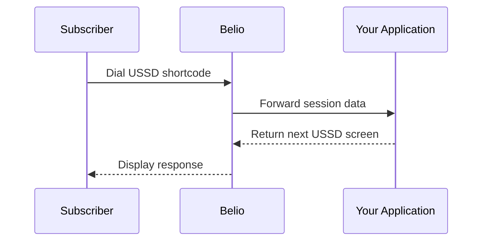

Belio USSD lets your application respond to subscriber interactions in real time.
When a user dials a registered shortcode, Belio forwards the session state to your callback URL and expects the next screen in return.

## How It Works

The USSD integration is request-driven and stateless from Belio's point of view:

1. A subscriber dials a registered USSD shortcode, for example `*123#`.
2. Belio resolves the shortcode to an active service channel and forwards the session to your callback URL.
3. Your application receives the full session context, including the cumulative input history.
4. Your application returns the next menu screen using `CON` to continue or `END` to close the session.

## Prerequisites

Before traffic can be routed to your application, ensure the following prerequisites have been met:

* An active **team**, **service**, **shortcode mapping**, and **subscription**.
* A provisioned **USSD shortcode**. You can request either:
    * **Shared USSD Shortcode** – Multiple services share the same shortcode, with routing handled by the Belio platform.
    * **Dedicated USSD Shortcode** – A shortcode reserved exclusively for your service, providing a branded and isolated USSD experience.
* An active **USSD service channel** configured for your service.
* A **callback URL** pointing to your application that can receive HTTP POST requests from the Belio backend.
* If you are still developing your integration, you can use one of the available **sandbox USSD shortcodes** to test your callback implementation before your production shortcode is provisioned.

Once these requirements have been completed, the Belio backend will resolve inbound USSD requests for your shortcode and forward each subscriber interaction to your configured callback URL.

## Integration Model

Belio sends the complete input history on every hop. That means your application should either:

- Rebuild the menu state from scratch on every request, or use `sessionId` to load persisted state and continue from the latest step.

The built-in flow engine uses the first approach: it replays the full `inputs` array through the menu graph on every request.

## Next Step

Read the [service callback specification](./service-callback) to see the request payload, response format, and required handling rules.
