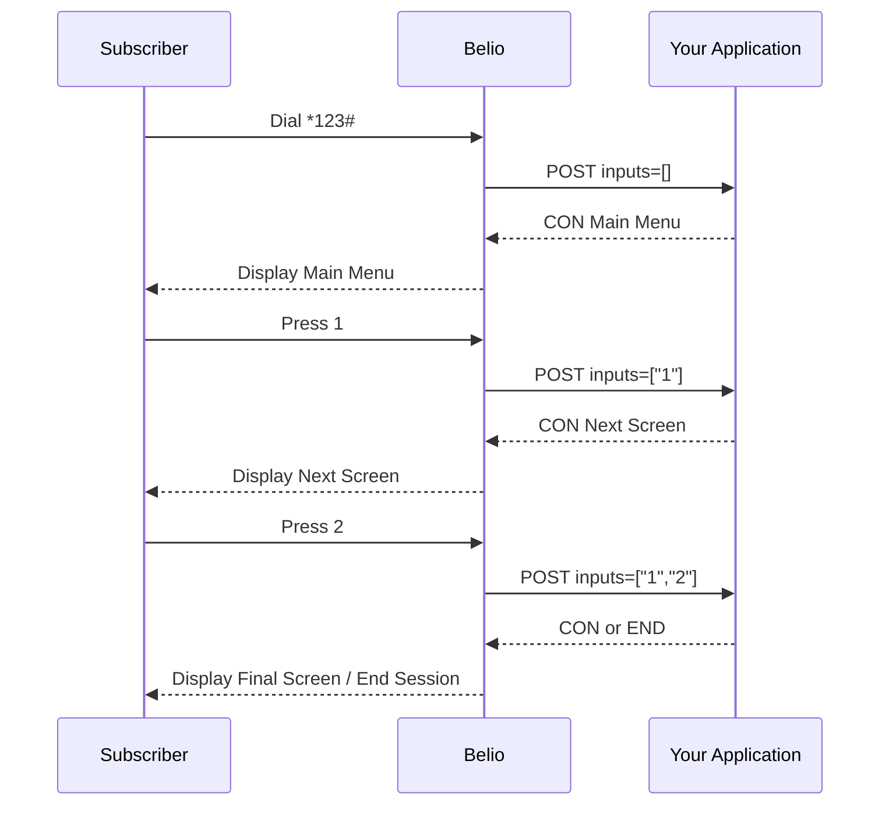

## Session Flow



Think of the integration as a loop:

1. The subscriber dials `*123#`.
2. Belio sends `inputs=[]` to your callback URL.
3. Your application returns `CON` with the main menu.
4. The subscriber presses `1`, then Belio sends `inputs=["1"]`.
5. Your application returns `CON` with the next screen.
6. The subscriber presses `2`, then Belio sends `inputs=["1", "2"]`.
7. Your application returns either `CON` to continue or `END` to close the session.

Your USSD application receives a JSON `POST` request for every subscriber interaction and must respond with the next screen.

## Action Meaning

| Action | Meaning                                             |
|--------|-----------------------------------------------------|
| `CON`  | Continue the session and show the next menu screen. |
| `END`  | End the session and close the USSD dialog.          |

## Input Handling

The `inputs` array contains the subscriber's cumulative selections for the session, so every request carries the full path already taken:

- First dial -> `inputs: []`
- After selecting `1` -> `inputs: ["1"]`
- After then selecting `2` -> `inputs: ["1", "2"]`
- After then selecting `3` -> `inputs: ["1", "2", "3"]`

Belio sends the full input history on every request, not just the latest keystroke. Your callback should either:

- Re-process all inputs from scratch on each request, or use `sessionId` to load session state and determine which input is new.

#### Sample expected responses from your application
- Continue the session and show the next menu screen:
```json
{
  "message": "Choose a category:\n\n1. Food\n2. Drinks\n0. Back",
  "action": "CON"
}
```
- End the session and close the USSD dialog:
```json
{
  "message": "Thank you for using our service.",
  "action": "END"
}
```
This response tells Belio to keep the session open and show the subscriber the next menu screen.

## Callback Endpoint

Configure the callback URL on your USSD service channel in the [Belio Cloud Portal](https://cloud.belio.co.ke/services/).

Belio sends a `POST` request to your callback URL with the session state for the current hop.

```http
POST {your-callback-url}
Content-Type: application/json
```

### Request Payload

Belio forwards a `UssdForwardRequest` payload.

```json
{
  "type": "UssdForwardRequest",
  "sessionId": "ATUid_12345",
  "msisdn": "254712345678",
  "code": "*123#",
  "inputs": ["1", "2"]
}
```

| Field       | Type       | Description                                                                                              |
|-------------|------------|----------------------------------------------------------------------------------------------------------|
| `type`      | string     | Always `UssdForwardRequest`.                                                                             |
| `sessionId` | string     | Unique identifier for the USSD session. Stable for the lifetime of the session.                          |
| `msisdn`    | string     | Subscriber phone number.                                                                                 |
| `code`      | string     | The dialed USSD shortcode, for example `*123#`.                                                          |
| `inputs`    | `string[]` | Ordered list of subscriber inputs for the session. Empty on the first dial, then cumulative on each hop. |

## Response Format

Return HTTP `200` with a JSON body in the following shape:

```json
{
  "message": "Choose a category:\n\n1. Food\n2. Drinks\n0. Back",
  "action": "CON"
}
```

| Field     | Type   | Description                                                     |
|-----------|--------|-----------------------------------------------------------------|
| `message` | string | Text displayed to the subscriber. Use `\n` for line breaks.     |
| `action`  | string | `CON` shows the next menu screen, `END` closes the USSD dialog. |

## Callback Requirements

| Requirement      | Value                                            |
|------------------|--------------------------------------------------|
| HTTP status      | `200`                                            |
| Content-Type     | `application/json`                               |
| Response timeout | `5 seconds` by default, configurable server-side |

Belio retries failed callbacks with exponential backoff, up to 5 attempts by default.
Malformed JSON responses are not retried.

## Invalid Responses

If your callback returns a non-200 status, times out, or returns JSON that does not match the expected schema, Belio treats that hop as failed and shows an unavailable message to the subscriber.

## Next Step

Use `sessionId` as the key for any server-side session storage. Belio also records session hops internally for observability.
